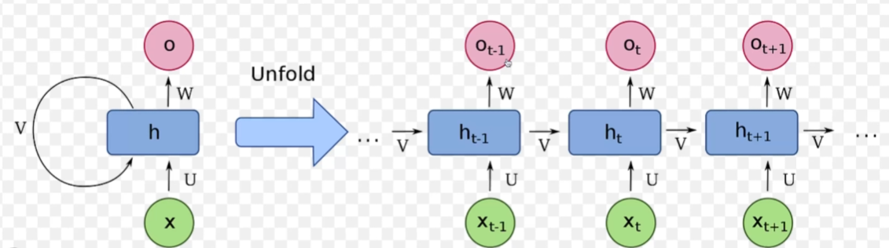

# RNN



한번에 표현하거나, 시간의 순서에 따라 표현하거나. 모두 동일한 RNN

 


“The” 단어 벡터가 input으로 들어가면, 내부의 0의 값을 가지는 hidden state h0가 input과 붙으면서 

fully connection layer tanh를 통해 hidden state h1을 업데이트함.


food 단어 vector가 input으로 들어가고, 기존의 hidden state h1이 input과 붙으면서 fullyconnection layer tanh를 통해 hidden state h2를 업데이트함


최종적으로 모든 vector에 hidden state ~ fullyconnection layer tahn ~ hidden state h4를 업데이트 하고나면 최종 output tensor를 통해 해당 문장의 postive, negative 구분을 함

위 설명에 대한 코드.

```python
import torch
import torch.nn as nn

class MyRNN(nn.Module):
    def __init__(self, input_size, hidden_size, output_size)
    # input_size, hidden_size = 4, output_size = 2 
        super().__init__()

        self.hidden_size = hidden_size
        self.i2h = nn.Linear(input_size + hidden_size, hidden_size)
        self.h2o = nn.Linear(hidden_size, output_size) 

    def forward(self, input, hidden):
        combined = torch.cat((input, hidden))
        hidden = torch.tanh(self.i2h(combined))
        output = self.h2o(hidden)
        return output, hidden

    def get_hidden(self):
        return torch.zeros(1, self.hidden_size)
  
rnn_model = MyRNN(input_size=4, hidden_size=4, output_size=2 )
hidden = rnn_model.get_hidden()

# the food is good
  
# output_tensor0, hidden = rnn_model(input_tensor0, hidden) # the
# output_tnesor1, hidden = rnn_model(input_tensor1, hidden) # food
# output_tensor2, hidden = rnn_model(input_tensor2, hidden) # is
# output_tensor3, hidden = rnn_model(input_tensor3, hidden) # good

_, hidden = rnn_model(input_tensor0, hidden) # hidden layer만 알면 됨
_, hidden = rnn_model(input_tensor1, hidden) # hidden layer만 알면 됨
_, hidden = rnn_model(input_tensor2, hidden) # hidden layer만 알면 됨
output_tensor3, _ = rnn_model(input_tensor3, hidden) # out layer만 알면 됨

# 좀 더 복잡하게 하기 위해서는 hidden_size를 늘리거나, 여러 층을 쌓아주면 됨.

```

# CHARACTER LEVEL RNN


이름 기반 성별 분류 RNN

이 모델은 이름의 철자를 문자 단위(character-level_로 받아, RNN을 통해 성별을 예측합니다.

1. 각 문자는 26개의 알파벳에 대한 one-hot encoding 형태로 표현됨. 예로, `"abby"`의 경우 `'a'`, `'b'`, `'b'`, `'y'` 각각이 길이 26짜리 one-hat vector로 변환됨.
2. RNN의 입력 차원은 26(알파벳 개수)이고, 은닉 상태(hidden state)는 크기 32개의 vector를 사용함.
3. RNN은 각 시점(time step)마다 입력 문자 vector와 이전 시점의 은닉 상태를 결합해 새로운 은닉 상태를 계산함.
    1. 1번째 시점: `'a'` → h₁ 계산
    2. 2번째 시점: `'b'` + h₁ → h₂ 계산
    3. 3번째 시점: `'b'` + h₂ → h₃ 계산
    4. 4번째 시점: `'y'` + h₃ → h₄ 계산
4. 마지막 시점의 은닉 상태 h₄는 최종 출력층으로 전달되어, `[1, 0]`(예: 남성), `[0, 1]`(예: 여성) 형태의 라벨과 비교됩니다.
    - 예측값과 실제 라벨 간의 **Cross Entropy Loss**를 계산한 뒤, 역전파(Backpropagation)를 통해 가중치를 업데이트합니다.
    - 전체 이름 데이터셋에 대해 이 과정을 반복하면, 이름을 기반으로 성별을 예측하는 모델이 학습됩니다

관련 코드는 https://github.com/lee-edgar/study/blob/main/rnn/genderClassification.ipynb에서 확인 가능.